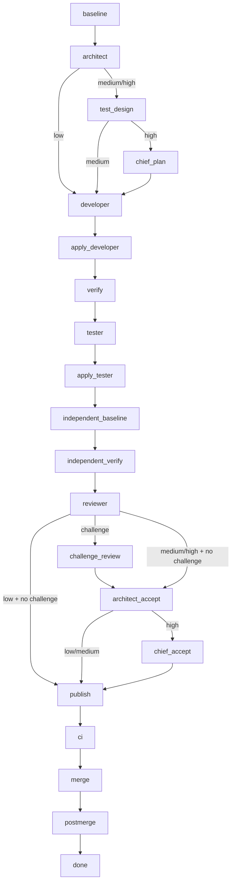

# Workflow map

The diagram below is generated from the actual shared
`workflow_transition(..., {"kind": "advance"})` reducer for all three risk
levels, with and without challenge review. It shows the **normal route of one
selected item**, not elapsed progress. Discovery (`reconcile`) selects an
eligible authorized item before `baseline`; after `done`, the controller checks
the goal and either selects another item or completes the run.

The operational adapter's `apply_developer` and `apply_tester` boundaries are
shown explicitly. Proposed edits are validated and applied by the controller.

## Which route applies?

| Condition | Effective graph |
|---|---|
| Adaptive enabled, no critical change | Item's current low / medium / high risk |
| Critical change detected | High, even if the reported risk is lower |
| Adaptive disabled | High |
| Challenge enabled | Adds challenge_review and architect_accept, including at low risk |

Risk can increase during an attempt. Missing test_design / chief_plan gates run
before resuming developer or verify via the recorded risk_gate_return. A higher
graph invalidates the candidate, reviews, CI and approval that no longer apply.

## Repairs, holds and effect boundaries

The graph describes successful advancement. These events can interrupt it:

| Event | Result |
|---|---|
| Product failure in verify, independent_verify or CI | Returns to developer within the bounded repair rules |
| Independent baseline fails its expected negative control | Returns to tester; with frozen tests, awaits the owner |
| Baseline/postmerge failure or an unavailable verification outcome | await_human; evidence determines whether retry is allowed |
| Review asks for repair | Returns to architect, test_design, developer or tester, with evidence invalidated |
| Base changes before merge | baseline is repeated; stale evidence/approval is invalidated |
| Owner approval required or policy/protocol violation | Held state; explain shows the original phase and the allowed recovery |
| External dependency unavailable | WAITING_EXTERNAL, normally retaining the execution phase |
| Uncertain model effect | Held for its original receipt or an explicit potentially charged retry |
| Pause | Orthogonal stop flag; it does not itself clear a hold |

The actual controller may also repair protocol/context responses within its
configured budget before holding. No diagram edge authorizes a model dispatch,
edit, merge or retry: the core evidence checks and durable effect receipts still
govern those operations. Independent baseline verification may intentionally
contain failing tests: it must establish the expected negative control.

## Keep this map current

`python3 scripts/generate_workflow_docs.py` regenerates this file.
`./scripts/agentctl validate` checks it against the reducer. CLI/UI routes are
derived from the same reducer; the UI separately shows actual recorded
transitions so a repair loop is visible rather than hidden by a progress bar.

Sources: [portable workflow](../control_plane_core/workflow.py),
[operational roles](../agent_runtime/roles.py),
[verification and release](../agent_runtime/lifecycle.py).
See [operator guide](OPERATOR-EXPERIENCE.md) for recovery commands and state layout.
